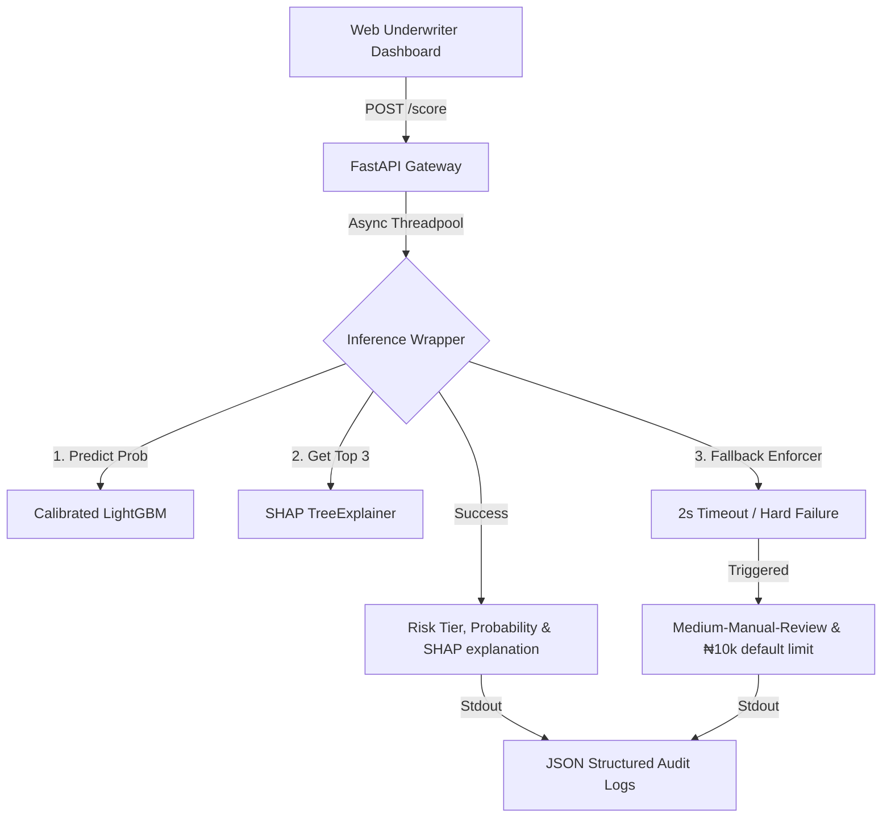

# Mono Decision Engine - Credit Scoring Demo

A production-ready credit decisioning engine built as a technical B2B fintech demonstration. The system features a FastAPI backend serving a pre-trained LightGBM classifier, a custom SHAP TreeExplainer for instant underwriting transparency, and a modern single-page dashboard with interactive presets.

## Architecture & System Resilience



- **Startup Loading**: On server boot, the system deserializes three serialized estimators from the `Artifacts/` directory (`risk_model.joblib`, `tfidf_vectorizer.joblib`, and `categorizer.joblib`).
- **Model Warmup**: To eliminate cold-start Numba compilation latency, a mock scoring payload is executed on server startup, warming up the tree explainer cache and ensuring subsequent requests execute in `<15ms`.
- **Async Execution**: Inference and SHAP calculations run in an async threadpool executor to avoid blocking the main event loop.
- **Resilient Fallback**: Inference is wrapped in a hard 2.0-second timeout. If execution fails or times out, the system automatically falls back to:
  - `probability`: `0.5`
  - `risk_tier` / `risk_band`: `"Medium-Manual-Review"`
  - `max_loan_affordable`: `₦10,000`
  - `reason_code`: `"ERR_SYSTEM_FALLBACK"`
- **Structured Audit Logs**: Every decision prints a single-line JSON structured log to `stdout` containing the raw request inputs, computed outputs, model version, and exact timestamps for ingestion into logging aggregators (e.g. ELK, Datadog) for model monitoring and retraining loops.

---

## API Endpoints

### 1. Health Status
* **Endpoint**: `GET /health`
* **Response**:
```json
{
  "status": "healthy",
  "model_version": "1.0.0",
  "timestamp": "2026-08-21T13:31:24.604436Z",
  "features_expected": ["income", "nsf_count", "dsr", "balance_volatility", "loan_inflow_ratio", "gambling_spend_index", "narration_risk_score"]
}
```

### 2. Risk Scoring Inference
* **Endpoint**: `POST /score`
* **Request Payload**:
```json
{
  "income": 5000.0,
  "nsf_count": 0,
  "dsr": 0.3,
  "balance_volatility": 500.0,
  "loan_inflow_ratio": 0.2,
  "gambling_spend_index": 0.0,
  "narration_risk_score": 0.1
}
```
* **Response Payload (Standard Model Decision)**:
```json
{
  "probability": 6.25e-34,
  "risk_tier": "Low",
  "risk_band": "Low",
  "max_loan_affordable": 1500,
  "top_features": [
    { "feature": "narration_risk_score", "shap_value": -6.8643 },
    { "feature": "balance_volatility", "shap_value": -0.3169 },
    { "feature": "loan_inflow_ratio", "shap_value": -0.1504 }
  ],
  "fallback": false,
  "reason_code": "MODEL_DECISION_SUCCESS"
}
```

---

## Underwriter Web Dashboard

The web UI is hosted directly at the root `/` route of the server, loading from the `static/` asset directory. Features include:
- **Tailwind CSS Enterprise Interface**: Clean glassmorphism components with dark mode and vibrant glow outlines keyed to the resulting risk tier.
- **Three Persona Presets**:
  1. **Low-Risk Prime**: High income, zero NSF, low DSR, clean narration.
  2. **Borderline Volatile**: Average income, moderate volatility, 1 NSF event.
  3. **High-Risk Gambler**: Low income, high NSF count, high gambling index.
- **Interactive Visualization**: Features an animated circular risk gauge, dynamic numerical readouts, and a custom horizontal bar chart rendering SHAP contributions (red indicating risk-increasing drivers, green representing risk-reducing drivers).

---

## Deployment & Dockerization

A minimal, multi-stage or compact Docker image is supplied in the repository using `python:3.9-slim`. It includes system packages such as `libgomp1` which are required by the LightGBM library.

### 1. Build Docker Image
```bash
docker build -t mono-risk-engine .
```

### 2. Run Container
```bash
docker run -p 8000:8000 mono-risk-engine
```
The application will be accessible at `http://localhost:8000/`.
